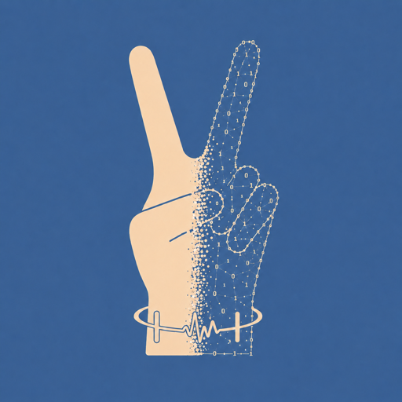
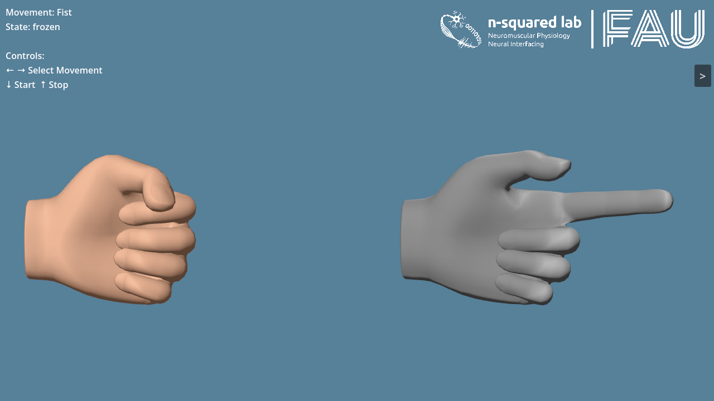

<div align="center">



# MyoGestic-VHI

**Real-time 3D hand visualisation for HD-sEMG, driven over LSL and gRPC.**

[Documentation](docs/index.md) ·
[MyoGestic](https://github.com/NsquaredLab/MyoGestic) ·
[N-squared Lab](https://www.nsquared.tf.fau.de/)

[](https://github.com/NsquaredLab/MyoGestic-VHI/actions/workflows/docs.yml)
[](https://github.com/NsquaredLab/MyoGestic-VHI/actions/workflows/release.yml)

</div>

---

VHI is the Godot / .NET front-end of the **[MyoGestic](https://github.com/NsquaredLab/MyoGestic)** stack. It renders two hands side-by-side: a **control hand** the operator cues with named movements, and a **predicted hand** driven continuously by an EMG model's output. Together they let an experimenter cue a movement and see what the myocontrol model predicts for it, frame by frame.



## How it fits together

VHI talks to MyoGestic over two channels, each chosen for the kind of traffic it carries:

- **LSL** for **continuous time-series**: `MyoGestic_Output` (prediction stream → predicted hand, ~32 Hz), the optional `MyoGestic_ControlPose` (operator-driven pose → control hand), and VHI's own `VHI_Control` / `VHI_Predict` outlets (60 Hz) so the experiment records what was actually shown on screen.
- **gRPC** for **discrete commands**: select a movement, freeze the hand, switch the control-hand driver mode, adjust speed. VHI hosts the server in-process on `127.0.0.1:50051`; MyoGestic is the client.

`proto/myogestic_vhi.proto` is the canonical wire contract for the gRPC side. MyoGestic vendors a copy and regenerates its Python stubs from it.

## Quick start

You need **Godot 4.6** with .NET support and the **.NET 8 SDK** on your `PATH` (Godot 4.6.1 bundles a .NET 8 host).

```bash
dotnet restore           # restore SharpLSL, Grpc.AspNetCore, Tomlyn
godot --path .           # open in the editor, F5 to run
```

Use **←/→** to cycle movements, **↓/↑** to start/stop, **space** to freeze the current pose.

### Drive it from your own EMG pipeline

Publish an LSL stream named `MyoGestic_Output` with 9 float channels:

```python
from pylsl import StreamInfo, StreamOutlet

info = StreamInfo("MyoGestic_Output", "MyoGestic_9DVector", 9, 32, "float32", "my_uid")
outlet = StreamOutlet(info)
outlet.push_sample([0.0] * 9)
```

Channel layout is thumb flex/abd, index, middle, ring, pinky, wrist flex/abd/rot. The sign convention is **negative = flexion**: a closed fist is roughly `[-1, -1, -1, -1, -1, -1, 0, 0, 0]` (all fingers and the thumb abduction pulled in, wrist neutral).

## Documentation

The full docs live in [`docs/`](docs/) and are built with MkDocs Material via ProperDocs:

```bash
dotnet tool restore                       # one-off: installs DefaultDocumentation.Console
./tools/gen_api_docs.sh                   # regenerates the C# API reference from the source
uv run --group docs properdocs serve      # browse at http://127.0.0.1:8000
```

Highlights:

- **[Getting Started](docs/getting-started.md)** — install Godot, restore, run, see a hand move
- **[Concepts](docs/concepts/index.md)** — architecture, the two hands, LSL streams, the gRPC control plane, control-hand modes, the movement set
- **[How-to guides](docs/how-to/index.md)** — drive VHI from MyoGestic, stream a custom pose, add a custom movement, build & export
- **[Reference](docs/reference/index.md)** — the full gRPC API, every LSL stream, every `[Export]` field. The reference also includes an auto-generated C# API surface (regenerated by `tools/gen_api_docs.sh`; the generated tree is gitignored, so run the script before serving the docs locally).
- **[Troubleshooting](docs/troubleshooting.md)** — the common failure modes with symptoms and fixes

## Building executables

```bash
godot --headless --export-release "macOS"           VHI.app
godot --headless --export-release "Windows Desktop" VHI.exe
godot --headless --export-release "Linux"           VHI.x86_64
```

**macOS gotcha** — the export needs to be re-signed without the hardened runtime, otherwise Godot's embedded .NET host silently fails to start and no C# code runs:

```bash
codesign --force --deep --sign - VHI.app
```

See [docs/how-to/build-and-export.md](docs/how-to/build-and-export.md) for the full export checklist, including how to pin the .NET 8 SDK.

## Project history

Originally published as [`NsquaredLab/Virtual-Hand-Interface`](https://github.com/NsquaredLab/Virtual-Hand-Interface). That repository is preserved as a historical artefact; all new development lives here. The rename makes VHI's place in the MyoGestic stack explicit.

## License

GPL-3.0 — see [`LICENSE`](LICENSE).

## How to cite

VHI is part of the **MyoGestic** stack. If you use it in your research, please cite the MyoGestic [paper](https://www.science.org/doi/abs/10.1126/sciadv.ads9150):

```bibtex
@article{
    Sîmpetru2025,
    author = {Raul C. Sîmpetru  and Dominik I. Braun  and Arndt U. Simon  and Michael März  and Vlad Cnejevici  and Daniela Souza de Oliveira  and Nico Weber  and Jonas Walter  and Jörg Franke  and Daniel Höglinger  and Cosima Prahm  and Matthias Ponfick  and Alessandro Del Vecchio },
    title = {MyoGestic: EMG interfacing framework for decoding multiple spared motor dimensions in individuals with neural lesions},
    journal = {Science Advances},
    volume = {11},
    number = {15},
    pages = {eads9150},
    year = {2025},
    doi = {10.1126/sciadv.ads9150},
    URL = {https://www.science.org/doi/abs/10.1126/sciadv.ads9150},
    eprint = {https://www.science.org/doi/pdf/10.1126/sciadv.ads9150},
}
```

Built by the **[N-squared Lab](https://www.nsquared.tf.fau.de/)** (Neuromuscular Physiology & Neural Interfacing) at Friedrich-Alexander-Universität Erlangen-Nürnberg.
