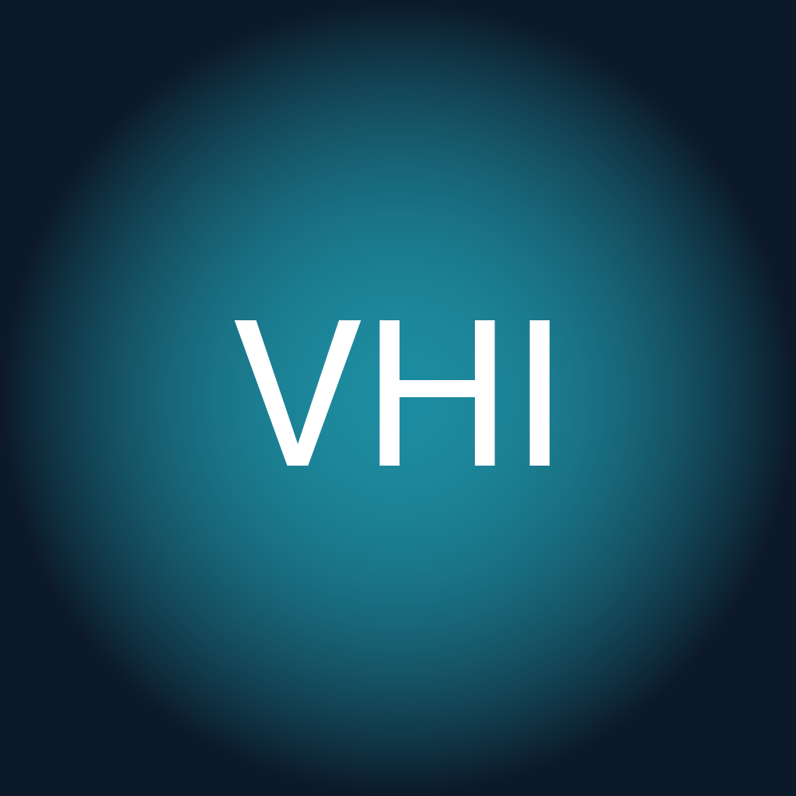
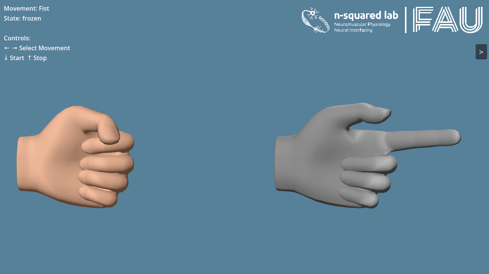

<div align="center">



# MyoGestic-VHI

**Real-time 3D hand visualisation for HD-sEMG, driven over LSL and gRPC.**

[Documentation](docs/index.md) ·
[MyoGestic](https://github.com/NsquaredLab/MyoGestic) ·
[N-squared Lab](https://www.nsquared.tf.fau.de/)

[](https://github.com/NsquaredLab/MyoGestic-VHI/actions/workflows/docs.yml)
[](https://github.com/NsquaredLab/MyoGestic-VHI/actions/workflows/release.yml)

</div>

---

VHI is the Godot / .NET front-end of the **[MyoGestic](https://github.com/NsquaredLab/MyoGestic)** stack. It renders two hands side-by-side: a **control hand** the operator cues with named movements, and a **predicted hand** driven continuously by an EMG model's output. Together they let an experimenter cue a movement and see what the myocontrol model predicts for it, frame by frame.



## How it fits together

VHI talks to MyoGestic over two transports, each chosen for the kind of traffic it carries:

- **LSL** for **continuous time-series**: one stream per DOF, inbound — `vhi.prediction.*` drives the predicted hand (~32 Hz) and the optional `vhi.control.pose.*` drives the control hand — plus VHI's own `VHI_Control` / `VHI_Predict` outlets (60 Hz, nine channels each) so the experiment records what was actually shown on screen.
- **gRPC** for **discovery, discrete state and verification**: `GetControlManifest` publishes every control VHI exports, `SetControl` carries held states, `SweepControl` reports what the rig actually did, and the same service gates a recording session and drives its trajectories. VHI hosts the server in-process on `127.0.0.1:50051`; MyoGestic is the client.

`proto/remote_control.proto` is the wire contract for the gRPC side. It is deliberately generic — `myogestic.remote.RemoteControl` is the contract *any* remote target serves, and VHI is one implementation of it. MyoGestic vendors a copy and regenerates its Python stubs from it. The pre-2.0 `myogestic.vhi.v1.VhiControl` service is gone — see [Upgrading to VHI 2.0](docs/upgrading-to-v2.md).

## Quick start

You need **Godot 4.6** with .NET support and the **.NET 8 SDK** on your `PATH` (Godot 4.6.1 bundles a .NET 8 host).

```bash
dotnet restore           # restore SharpLSL, Grpc.AspNetCore, Tomlyn
godot --path .           # open in the editor, F5 to run
```

Use **←/→** to cycle movements, **↓/↑** to start/stop, **space** to freeze the current pose.

### Drive it from your own EMG pipeline

Publish **one LSL stream per DOF**, named for that DOF's address and one `float32` channel wide:

```python
from pylsl import StreamInfo, StreamOutlet

info = StreamInfo("vhi.prediction.index", "MyoGestic_Control", 1, 32, "float32", "my_uid")
outlet = StreamOutlet(info)
outlet.push_sample([1.0])          # the predicted hand's index flexes; nothing else moves
```

Nine addresses drive the predicted hand — thumb flexion and abduction, index, middle, ring and little flexion, then wrist flexion, abduction and rotation. All nine render; there is no dead DOF on this rig. Publish only the ones you drive: there is no frame to fill in, and a DOF nobody publishes holds what it was last commanded to.

The address **is** the stream name — that is the whole of the inbound transport contract, and the manifest carries nothing further about the wire. A stream that resolves under one of those names and is not exactly one channel wide is refused rather than read at index 0.

Values are **standard**: `+1` is the direction the DOF's name denotes, so a closed fist is `[1, -1, 1, 1, 1, 1, 0, 0, 0]` across the nine — five flexions and an *ad*ducted thumb. Before 2.0 the same fist was `[-1, -1, …]` in VHI's own rig units. Rather than hard-code any of it, call `GetControlManifest`, check that its `vocabulary_version` is at least `"2"`, and publish under the addresses it lists — see [the LSL reference](docs/reference/lsl-reference.md#the-nine-dofs).

## Documentation

The full docs live in [`docs/`](docs/) and are built with MkDocs Material via ProperDocs:

```bash
dotnet tool restore                       # one-off: installs DefaultDocumentation.Console
./tools/gen_api_docs.sh                   # regenerates the C# API reference from the source
uv run --group docs properdocs serve      # browse at http://127.0.0.1:8000
```

Highlights:

- **[Getting Started](docs/getting-started.md)** — install Godot, restore, run, see a hand move
- **[Concepts](docs/concepts/index.md)** — architecture, the two hands, LSL streams, the gRPC control plane, control-hand modes, the movement set
- **[How-to guides](docs/how-to/index.md)** — drive VHI from MyoGestic, stream a custom pose, add a custom movement, build & export
- **[Reference](docs/reference/index.md)** — the full gRPC API, every LSL stream, every `[Export]` field. The reference also includes an auto-generated C# API surface (regenerated by `tools/gen_api_docs.sh`; the generated tree is gitignored, so run the script before serving the docs locally).
- **[Troubleshooting](docs/troubleshooting.md)** — the common failure modes with symptoms and fixes

## Building executables

```bash
godot --headless --export-release "macOS"           VHI.app
godot --headless --export-release "Windows Desktop" VHI.exe
godot --headless --export-release "Linux"           VHI.x86_64
```

**macOS gotcha** — the export needs to be re-signed without the hardened runtime, otherwise Godot's embedded .NET host silently fails to start and no C# code runs:

```bash
codesign --force --deep --sign - VHI.app
```

See [docs/how-to/build-and-export.md](docs/how-to/build-and-export.md) for the full export checklist, including how to pin the .NET 8 SDK.

## Project history

Originally published as [`NsquaredLab/Virtual-Hand-Interface`](https://github.com/NsquaredLab/Virtual-Hand-Interface). That repository is preserved as a historical artefact; all new development lives here. The rename makes VHI's place in the MyoGestic stack explicit.

## License

GPL-3.0 — see [`LICENSE`](LICENSE).

## How to cite

VHI is part of the **MyoGestic** stack. If you use it in your research, please cite the MyoGestic [paper](https://www.science.org/doi/abs/10.1126/sciadv.ads9150):

```bibtex
@article{
    Sîmpetru2025,
    author = {Raul C. Sîmpetru  and Dominik I. Braun  and Arndt U. Simon  and Michael März  and Vlad Cnejevici  and Daniela Souza de Oliveira  and Nico Weber  and Jonas Walter  and Jörg Franke  and Daniel Höglinger  and Cosima Prahm  and Matthias Ponfick  and Alessandro Del Vecchio },
    title = {MyoGestic: EMG interfacing framework for decoding multiple spared motor dimensions in individuals with neural lesions},
    journal = {Science Advances},
    volume = {11},
    number = {15},
    pages = {eads9150},
    year = {2025},
    doi = {10.1126/sciadv.ads9150},
    URL = {https://www.science.org/doi/abs/10.1126/sciadv.ads9150},
    eprint = {https://www.science.org/doi/pdf/10.1126/sciadv.ads9150},
}
```

Built by the **[N-squared Lab](https://www.nsquared.tf.fau.de/)** (Neuromuscular Physiology & Neural Interfacing) at Friedrich-Alexander-Universität Erlangen-Nürnberg.
