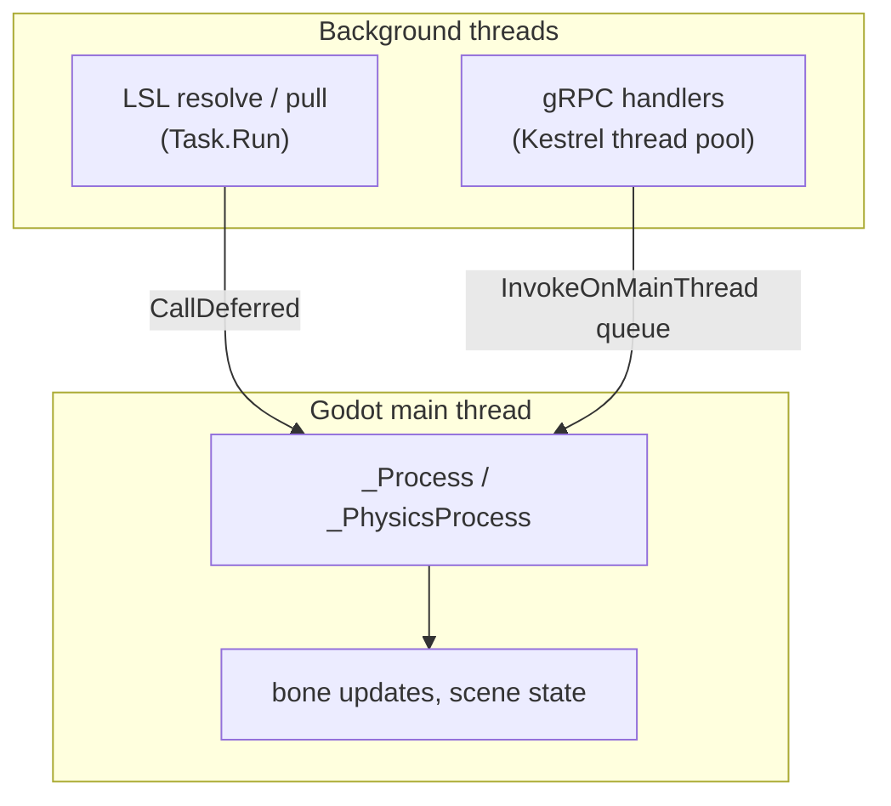

# Architecture

VHI is a single Godot 4.6 (.NET) scene. Everything below lives under one root
`Node3D`, `Main`, in `scenes/HandMain.tscn`.

## Scene tree

```text
Main (Node3D)
├── WorldEnvironment
├── LSLCommunicationController   # all LSL I/O - inlets + outlets
├── GrpcControlServer            # in-process gRPC server (Kestrel)
├── ControlHand (ControlHandSkeleton)    # ground-truth / commanded hand
├── PredictedHand (PredictedHandSkeleton)  # model-output hand
├── Camera3D
├── MovementUI                   # on-screen movement/state label
├── Logo
├── DirectionalLight3D
└── ControlPanel                 # runtime UI: speed, smoothing, chirality
```

Each piece is one `Node` with one job:

| Node | Responsibility |
|---|---|
| `LSLCommunicationController` | Resolves the LSL inlets, pulls samples, publishes the `VHI_Control` / `VHI_Predict` outlets. See [LSL streams](lsl-streams.md). |
| `GrpcControlServer` | Hosts the `VhiControl` gRPC service in-process. See [gRPC control plane](grpc-control.md). |
| `ControlHandSkeleton` | Drives the control hand - predefined movements, streamed pose, or idle. See [The two hands](hands.md). |
| `PredictedHandSkeleton` | Drives the predicted hand from the `MyoGestic_Output` stream, with optional smoothing. |
| `ControlPanelUI` | Runtime sliders/toggles for speed, hold/rest times, smoothing, plus buttons to load or open the movement-config TOML. |

!!! note "`LSLWrapper`"
    `LSLCommunicationController` never touches SharpLSL directly - it goes
    through `src/LSLWrapper.cs`, which loads the SharpLSL assembly and calls
    into it by **reflection**. This is deliberate: loading SharpLSL's types
    eagerly inside Godot's host triggers a static-initialisation hang.

## Skeleton mapping

Both hands use the same FBX models (`models/WVRLeftHand_1106_ASCII.fbx`,
`WVRRightHand_…`). Each FBX has a **26-bone** skeleton named
`WaveBone_1 … WaveBone_24`, but VHI only animates a **16-joint** subskeleton -
the wrist plus three joints per finger:

```text
index  joint              FBX bone
  0    wrist               WaveBone_1
  1-3  thumb  prox/mid/dist WaveBone_3 / 4 / 5
  4-6  index  prox/mid/dist WaveBone_7 / 8 / 9
  7-9  middle prox/mid/dist WaveBone_12 / 13 / 14
 10-12 ring   prox/mid/dist WaveBone_17 / 18 / 19
 13-15 pinky  prox/mid/dist WaveBone_22 / 23 / 24
```

At `_Ready()` each skeleton builds a `boneName → boneIndex` map by
`FindBone`-ing those names. Poses are applied as per-joint Euler rotations
(degrees → radians → quaternion → `SetBonePoseRotation`). A 9-DOF input vector
(see [LSL streams](lsl-streams.md)) is expanded across these 16 joints by
per-joint maximum-flexion limits carried over from the original Unity
implementation.

## Threading model

Godot's scene tree is single-threaded. Both communication layers do their
blocking work off the main thread and marshal results back:



- **LSL** - stream resolution blocks for ~1 s, so it runs on a `Task.Run`
  background thread; `CallDeferred` marshals logging and state changes back to
  the main thread. Sample *pulls* are non-blocking and happen in `_Process`.
- **gRPC** - handler methods run on Kestrel's thread pool. Each one hands a
  closure to `GrpcControlServer.InvokeOnMainThread`, which enqueues it; the
  queue is drained every frame in `_Process` and the result is returned to the
  caller via a `TaskCompletionSource`. So every scene mutation still happens on
  the main thread, and the unary RPC still gets its synchronous ack.

## The .NET hosting workaround

VHI's gRPC server uses `Grpc.AspNetCore` (Kestrel), which depends on the
**ASP.NET Core shared framework**. Godot's managed host does not follow the
standard .NET shared-framework probing rules
([godotengine/godot#112701](https://github.com/godotengine/godot/issues/112701)),
so those assemblies fail to load by default.

`src/SharedFrameworkAssemblyLoader.cs` fixes this: a `[ModuleInitializer]`
registers an `AssemblyLoadContext.Resolving` handler that probes the on-disk
.NET shared-framework directories. It runs before any ASP.NET Core type is
JITed, so Kestrel loads cleanly. You never call it directly - it just has to
exist in the assembly.

This matters for [exporting](../how-to/build-and-export.md): see the macOS
hardened-runtime note there.

## gRPC code generation

The C# gRPC types - `VhiControl.VhiControlBase` and the request/reply
messages - are **generated at build time** by `Grpc.Tools` from
`proto/myogestic_vhi.proto` (see the `<Protobuf>` item in `VHI_godot.csproj`).
The `.proto` is the canonical contract; there are no hand-written stub files in
the repo. Edit the `.proto` and rebuild to regenerate them. MyoGestic vendors
its own copy of the same `.proto` and regenerates its Python stubs separately.
