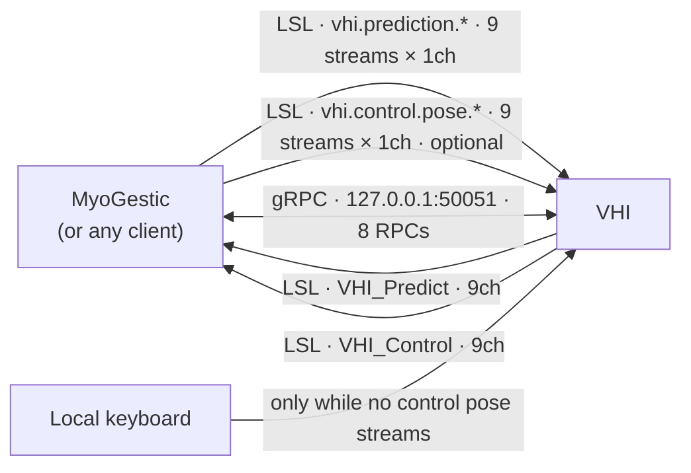

# Every signal in and out

One page listing everything that crosses the VHI process boundary, sorted by protocol.
Twenty LSL streams, eight RPCs, and one input that is neither.

This is the inventory, not the detail: [LSL streams](lsl-reference.md) documents each
stream's metadata and channel layout, and [gRPC API](grpc-api.md) documents each RPC's
messages field by field.

## LSL - twenty streams

**The two directions do not share a shape.** Inbound is one stream per DOF, one channel
wide; outbound is two whole-pose read-backs, nine channels wide. Check which direction a
statement is about before you act on it.

### Inbound - VHI reads, one stream per DOF

| streams | drives | units | present |
|---|---|---|---|
| `vhi.prediction.*` — nine of them, one per DOF, 1 × `float32` each | the **predicted** hand | standard, always | each optional |
| `vhi.control.pose.*` — nine of them, one per DOF, 1 × `float32` each | the **control** hand, while any is delivering | standard, always | each optional |

Both families are standard unconditionally: `+1` means the direction the DOF's *name*
denotes. There is one encoding, so nothing is negotiated. Neither needs a request either
— publishing *is* the request: the control hand renders its streams while a sample has
arrived on **any** of them within the last five seconds
(`ControlPoseStaleAfterSeconds`), and runs its own movements otherwise. Both families
work the same way; the control hand's used to need a handshake and no longer does.

All are resolved **by name**, first match wins. One liblsl resolve every ~5 s covers
every name still missing, so the resolve count does not grow with the number of DOFs.

#### A stream is one DOF, and its name is that DOF's address

`GetControlManifest` reports the address and says nothing further about the wire, because
there is nothing further to say: the address **is** the stream name, and the stream is one
`float32` channel wide. A client publishes under the name it read and never places a value
by position. There is no whole-pose frame and nothing waits for one.

The width is enforced on receipt. A resolved stream that is not exactly one channel wide
is logged as an error and its inlet is never opened — it is not read at channel 0 and its
extra channels are not ignored, because element zero of a nine-channel pose is the thumb
and every DOF would have rendered the thumb.

A sample is applied the moment it arrives; the DOFs that did not deliver hold what they
were last commanded to. That is deliberate, not a tolerance: the DOFs are independently
actuated, may come from different producers, and may update at different rates, so a hand
whose index has moved and whose thumb has not is a real pose. **Two producers can each
own some DOFs of the same hand without contending** — the capability this shape exists
for. To put a DOF back at rest, push `0`; going silent is a different statement, and on
the control hand the last stream going silent releases the whole hand.

The nine were once one nine-channel stream per hand (`MyoGestic_Output`,
`MyoGestic_ControlPose`), positionally laid out. Both are gone. A shared frame forced
every producer to fill in DOFs it did not drive, and made the layout something two
codebases had to agree on in the right order.

### Outbound - VHI publishes

| stream | reports | units | `source_id` |
|---|---|---|---|
| `VHI_Predict` | the predicted hand's pose | **standard** | `predicted_hand_001` |
| `VHI_Control` | the control hand's pose | **standard** | `control_hand_002_standard` |

Both are 9 channels at 60 Hz nominal, carry the channel labels below, and carry a
`config_file` metadata entry. Unlike the inlets, these are **always full width and always
a whole pose**: a read-back is a recording, and a recording wants one row per instant
rather than nine independently timed ones.

Both are standard, and that is the point: push `+1` on `vhi.prediction.index` and read it
back as `+1` on `VHI_Predict` channel 2, and a fist on the ground-truth stream is the same
vector that would produce one on the predicted hand. They disagreed once — `VHI_Control`
published VHI's own rig
own units, opposite on five channels — so every model trained on it needed its weights
flipped by hand, and nothing on either wire said so. Sessions recorded before that are in
the old units and were converted once by `myogestic.tools.migrate_vhi_sessions`; the
outlets advertise `pose_convention` so the two cannot be confused.

### The nine DOFs, and where each one lands

The channel column is **the outlets'**. Inbound it is not an index at all: prefix the
address suffix with `vhi.prediction.` or `vhi.control.pose.`, and publish one
single-channel stream under that name.

| address suffix | outlet ch | outlet label | bone | renders? |
|---|---|---|---|---|
| `thumb.flexion` | 0 | `ThumbFlexion` | 1/2/3, X | yes |
| `thumb.abduction` | 1 | `ThumbAbduction` | 1/2/3, Z | yes - the distal bone's Z gain is `0`, so two of three move |
| `index` | 2 | `IndexFlexion` | 4, 5, 6 | yes |
| `middle` | 3 | `MiddleFlexion` | 7, 8, 9 | yes |
| `ring` | 4 | `RingFlexion` | 10, 11, 12 | yes |
| `little` | 5 | `PinkyFlexion` | 13, 14, 15 | yes |
| `wrist.flexion` | 6 | `WristFlexion` | 0, X | yes - bone 0 parents every digit, so the whole hand turns |
| `wrist.abduction` | 7 | `WristAbduction` | 0, Z | yes |
| `wrist.rotation` | 8 | `WristRotation` | 0, Y | yes - pronation/supination, `±179°`; see the warning in [LSL streams](lsl-reference.md) |

## gRPC - eight RPCs on `127.0.0.1:50051`

One service, `VhiControl`, hosts all eight. All are request/reply; nothing streams.

### `VhiControl`

| RPC | in | out |
|---|---|---|
| `GetControlManifest` | - | every control VHI exports, each with its kind and its range or states, plus the `vocabulary_version` a client gates on. A streamed control's address is the name to publish it under. Call it first |
| `SetControl` | a `continuous` map and a `discrete` map | applied, or a rejection reason per name |
| `SweepControl` | one DOF name and a duration | which bones moved, and the signed degrees at `hi` and at `lo` |
| `SetPresentation` | blend on/off and speed | applied. Appearance only - it does not change a commanded value |
| `SetRecordingSession` | active flag | applied |
| `StartRecordingTrajectory` | a movement name to cycle as a subject cue | applied |
| `StopRecordingTrajectory` | - | applied (idempotent) |
| `GetRecordingSessionState` | - | recording flag, whether a trajectory runs, its movement, the animation state, `available_movements`, and the selected movement |

The manifest also carries a `vocabulary_version`, and it is **`"2"`** on this build. That
is a gate rather than a label: a client declares the oldest vocabulary it can drive and
refuses anything below it, by name, when it binds. VHI and its clients are separately
installed applications, so upgrading one does not upgrade the other, and a skewed pair
otherwise fails in the quietest possible way — an old client publishing a wide pose stream
nobody reads any more, or waiting on a shape nobody publishes, with no error anywhere and
a hand that simply never moves. Vocabulary `1` described the transport with per-capability
`stream_name` and `channel` fields; `2` is one stream per DOF, named for the address, one
channel wide.

## Neither protocol

**Local keyboard** drives the control hand's movement state machine, and only while no
control-pose stream is delivering. It belongs in this list because it is a *third*
writer to the same bones as the `vhi.control.pose.*` streams and `vhi.control.gesture` -
which is why a live stream refuses discrete DOFs by name rather than letting them apply
and then overwriting them, and why `SetRecordingSession` exists to gate the keyboard off
during a recording.

## Which protocol carries what

The rule is one line: **a per-frame continuous pose goes on LSL; anything that needs an
answer goes on gRPC.** A pose wants fire-and-forget delivery and a shared clock so it can
be recorded alongside EMG; "can you render these six DOFs?" wants a reply, which LSL has no
way to give.

`SetControl` *can* carry continuous values, and is meant to for low-rate updates only. One
control never touches LSL at all: `vhi.control.gesture` is a **held state**, and a held
state travels over `SetControl` exclusively.

Nothing in an address says which wire it uses — its **kind** does, and there is no other
field to read. A `CONTINUOUS` capability is streamed, under a stream named for its own
address; a `DISCRETE` one is a held state and drives no stream at all.

## Asymmetries worth remembering

- **The two directions have different shapes.** Inbound, a stream is one DOF and its name
  is that DOF's address. Outbound, a stream is a whole hand and a DOF is a channel number.
  A sentence about "channel 2" is about the read-backs.
- **The two hands have separate namespaces.** `vhi.prediction.index` is the model's index
  and `vhi.control.pose.index` is the operator's — different streams, different hands,
  and neither can be routed into the other by a configuration mistake.
- **Both outlets are standard.** They disagreed once; see above.
- **A DOF nobody publishes is not an error.** It holds its last commanded value; the hand
  goes on rendering. Only the *control* hand treats total silence as a release.
- **Nothing has to be opened first.** The service keeps no per-client session state and
  validates each call against its address table, so `SetControl`, `SweepControl` and the
  pose streams work the moment a client sends them. `GetControlManifest` is a read, not a
  registration — call it because you need the stream names, not because VHI is waiting
  for it.
- **Nominal rates disagree.** MyoGestic pushes at 32 Hz, VHI publishes at 60 Hz nominal.
  Nominal only - neither side paces off the other's number.
- **A still-streaming producer wins, per DOF.** An LSL outlet repeats its last sample at
  its own rate, and VHI applies whatever arrives. So a stale outlet left behind by an
  earlier process keeps overwriting that one DOF against `SetControl` and `SweepControl`
  alike, and VHI re-resolves a name only while it has no inlet for it. Kill old producers
  before measuring anything.
