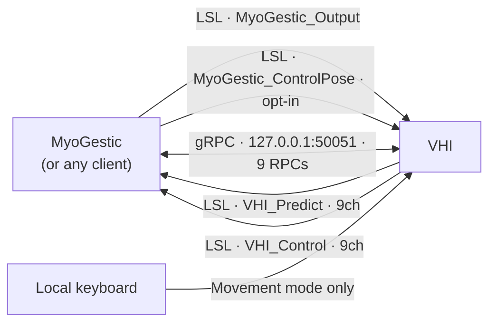

# Every signal in and out

One page listing everything that crosses the VHI process boundary, sorted by protocol.
Four LSL streams, nine RPCs, and one input that is neither.

This is the inventory, not the detail: [LSL streams](lsl-reference.md) documents each
stream's metadata and channel layout, and [gRPC API](grpc-api.md) documents each RPC's
messages field by field.

## LSL - four streams

### Inbound - VHI reads

| stream | drives | units | present |
|---|---|---|---|
| `MyoGestic_Output` | the **predicted** hand | canonical, always | always |
| `MyoGestic_ControlPose` | the **control** hand, in `Stream` mode | negotiated | only once declared |

`MyoGestic_Output` is canonical unconditionally: `+1` means the direction the channel's
name denotes, whatever the client declared. `MyoGestic_ControlPose` is the negotiable one -
`DeclareRequest.control_pose_encoding` chooses canonical or raw rig units, and declaring it
at all is what switches the control hand into `Stream` mode, since v2 has no mode RPC.

Both are resolved **by name**, first match wins.

#### Neither one has to be nine channels wide

A producer that labels its LSL channels with **control addresses** may send however many
controls it drives, in whatever order. VHI reads the labels from the sender's stream
description and places each value by name, so two channels carrying
`vhi.prediction.index` and `vhi.prediction.middle` is a complete stream rather than a
truncated nine.

An unlabelled producer sends the pose layout below, positionally, and is read exactly as
it always was. So is a producer whose labels are *not* addresses this hand renders — a
stream naming its channels for a human reader falls back rather than routing on a partial
match, because dropping the channels that did not resolve would misattribute every later
one.

`myogestic.vhi.VhiTarget` builds a labelled stream when constructed with `interface=`
instead of an outlet.

### Outbound - VHI publishes

| stream | reports | units | `source_id` |
|---|---|---|---|
| `VHI_Predict` | the predicted hand's pose | **canonical** | `predicted_hand_001` |
| `VHI_Control` | the control hand's pose | **raw rig units** | `control_hand_001` |

Both are 9 channels at 60 Hz nominal, carry the channel labels below, and carry a
`config_file` metadata entry. Unlike the inlets, these are always full width: they report a
whole pose, not a selection.

The unit difference is deliberate. `VHI_Predict` is canonical, so pushing `+1` on
`MyoGestic_Output` and reading it back returns `+1` - a round-trip through the predicted
hand is the identity rather than a sign flip. `VHI_Control` stays in rig units because
every session recorded before 2.0 is in them, cannot be re-recorded, and stays readable by
the same decoder.

### The pose layout

The order a stream uses when nothing labels it, and the order both outlets always use:

| ch | label | bone | renders? |
|---|---|---|---|
| 0 | `ThumbFlexion` | 1/2/3, X | yes |
| 1 | `ThumbAbduction` | 1/2/3, Z | yes - the distal bone's Z gain is `0`, so two of three move |
| 2 | `IndexFlexion` | 4, 5, 6 | yes |
| 3 | `MiddleFlexion` | 7, 8, 9 | yes |
| 4 | `RingFlexion` | 10, 11, 12 | yes |
| 5 | `PinkyFlexion` | 13, 14, 15 | yes |
| 6 | `WristFlexion` | 0, X | yes - bone 0 parents every digit, so the whole hand turns |
| 7 | `WristAbduction` | 0, Z | yes |
| 8 | `WristRotation` | 0, Y | yes - pronation/supination, `±179°`; see the warning in [LSL streams](lsl-reference.md) |

## gRPC - nine RPCs on `127.0.0.1:50051`

Two services share the port. Both are request/reply; nothing streams.

### `VhiCanonicalControl`

| RPC | in | out |
|---|---|---|
| `GetControlManifest` | - | every control VHI exports, with the semantics VHI declares for each |
| `Declare` | the DOFs a client intends to drive | a verdict **per DOF**, the continuous stream name, its channel order, the encoding, and whether the renderer blends |
| `SetControl` | a `continuous` map and a `discrete` map | applied, or a rejection reason per name |
| `SweepControl` | one DOF name and a duration | which bones moved, and the signed degrees at `hi` and at `lo` |
| `SetPresentation` | blend on/off and speed | applied. Appearance only - it does not change a commanded value |

### `VhiTrainingAid`

| RPC | in | out |
|---|---|---|
| `SetRecordingSession` | active flag | applied |
| `StartTrainingProgram` | a movement name to cycle as a subject cue | applied |
| `StopTrainingProgram` | - | applied (idempotent) |
| `GetTrainingState` | - | recording flag, whether a program runs, its movement, the animation state, `available_movements`, and the selected movement |

## Neither protocol

**Local keyboard** drives the control hand's movement state machine, in `Movement` mode
only. It belongs in this list because it is a *third* writer to the same bones as
`MyoGestic_ControlPose` and `vhi.control.gesture` - which is why declaring a control-pose
stream together with a discrete DOF is refused rather than arbitrated.

## Which protocol carries what

The rule is one line: **a per-frame continuous pose goes on LSL; anything that needs an
answer goes on gRPC.** A pose wants fire-and-forget delivery and a shared clock so it can
be recorded alongside EMG; "can you render these six DOFs?" wants a reply, which LSL has no
way to give.

`SetControl` *can* carry continuous values, and is meant to for low-rate updates only. One
control never touches LSL at all: `vhi.control.gesture` is a held state, reported with
`channel = -1`, and travels over gRPC exclusively.

Nothing in an address says which wire it uses. Read `stream_name` on the capability: empty
means gRPC-only.

## Asymmetries worth remembering

- **Both inbound streams number from 0.** `MyoGestic_Output` channel 2 is the model's
  index; `MyoGestic_ControlPose` channel 2 is the operator's. Same number, different hand -
  which is why a client must say which stream it drives, and why labelling with the full
  address rather than `index` is what makes a stream unambiguous.
- **`VHI_Predict` is canonical; `VHI_Control` is not.** See above.
- **The inlets may be narrow; the outlets never are.**
- **`Declare` is optional for the predicted hand, mandatory for the control hand.** The
  service keeps no per-client session state and validates each call against its address
  table, so `SetControl`, `SweepControl` and the pose stream all work undeclared. The
  control hand is the exception: without a declaration it is not in `Stream` mode, so its
  addresses are not renderable.
- **Nominal rates disagree.** MyoGestic pushes at 32 Hz, VHI publishes at 60 Hz nominal.
  Nominal only - neither side paces off the other's number.
- **A still-streaming producer wins.** The renderer replaces its whole pose from the inlet
  every frame, and an LSL outlet repeats its last sample at its own rate. So a stale outlet
  left behind by an earlier process overrides `SetControl` and `SweepControl` alike, and
  VHI re-resolves by name only while it has no inlet at all. Kill old producers before
  measuring anything.
