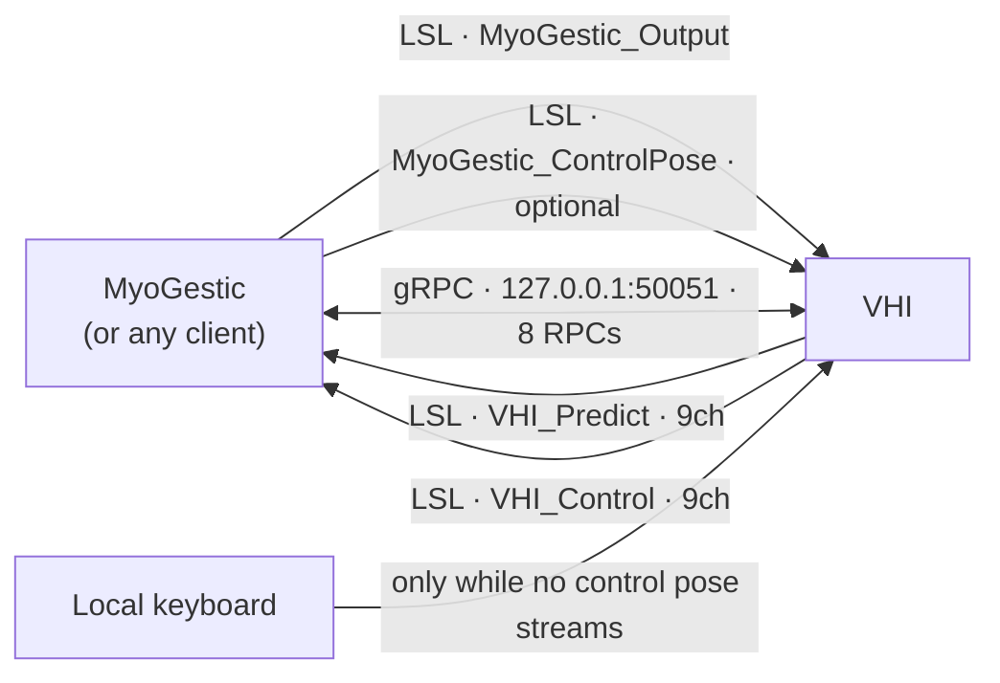

# Every signal in and out

One page listing everything that crosses the VHI process boundary, sorted by protocol.
Four LSL streams, eight RPCs, and one input that is neither.

This is the inventory, not the detail: [LSL streams](lsl-reference.md) documents each
stream's metadata and channel layout, and [gRPC API](grpc-api.md) documents each RPC's
messages field by field.

## LSL - four streams

### Inbound - VHI reads

| stream | drives | units | present |
|---|---|---|---|
| `MyoGestic_Output` | the **predicted** hand | standard, always | always |
| `MyoGestic_ControlPose` | the **control** hand, while it is delivering | standard, always | optional |

`MyoGestic_Output` is standard unconditionally: `+1` means the direction the channel's
name denotes. `MyoGestic_ControlPose` takes the same convention — there is one encoding
now, so nothing is negotiated — and it needs no request either. Publishing it *is* the
request: the control hand renders it while a sample has arrived within the last five
seconds (`ControlPoseStaleAfterSeconds`) and runs its own movements otherwise. Both
inlets work the same way; the control hand's used to need a handshake and no longer
does.

Both are resolved **by name**, first match wins.

#### Both are the renderer's own pose layout

A channel *is* an address: the manifest says `vhi.prediction.index` is channel 2, and a
producer writes it there. Nothing is negotiated, labelled or reconstructed — both ends
read one table. Channels a producer leaves at `0` command rest, which is what rest is.

This was once negotiable: a producer could compact its frame to only the controls it drove
and label each channel with its address, and VHI would read those labels back to work out
the mapping. Reading them meant asking the inlet for its stream info, which is the only
thing that starts liblsl's `info_receiver` thread — and cancelling that thread mid-request
crashed the renderer. The compaction saved three floats a frame.

### Outbound - VHI publishes

| stream | reports | units | `source_id` |
|---|---|---|---|
| `VHI_Predict` | the predicted hand's pose | **standard** | `predicted_hand_001` |
| `VHI_Control` | the control hand's pose | **standard** | `control_hand_002_standard` |

Both are 9 channels at 60 Hz nominal, carry the channel labels below, and carry a
`config_file` metadata entry. Unlike the inlets, these are always full width: they report a
whole pose, not a selection.

Both are standard, and that is the point: push `+1` on `MyoGestic_Output` and read it
back as `+1`, and a fist on the ground-truth stream is the same vector that would produce
one on the predicted hand. They disagreed once — `VHI_Control` published the renderer's
own units, opposite on five channels — so every model trained on it needed its weights
flipped by hand, and nothing on either wire said so. Sessions recorded before that are in
the old units and were converted once by `myogestic.tools.migrate_vhi_sessions`; the
outlets advertise `pose_convention` so the two cannot be confused.

### The pose layout

The order a stream uses when nothing labels it, and the order both outlets always use:

| ch | label | bone | renders? |
|---|---|---|---|
| 0 | `ThumbFlexion` | 1/2/3, X | yes |
| 1 | `ThumbAbduction` | 1/2/3, Z | yes - the distal bone's Z gain is `0`, so two of three move |
| 2 | `IndexFlexion` | 4, 5, 6 | yes |
| 3 | `MiddleFlexion` | 7, 8, 9 | yes |
| 4 | `RingFlexion` | 10, 11, 12 | yes |
| 5 | `PinkyFlexion` | 13, 14, 15 | yes |
| 6 | `WristFlexion` | 0, X | yes - bone 0 parents every digit, so the whole hand turns |
| 7 | `WristAbduction` | 0, Z | yes |
| 8 | `WristRotation` | 0, Y | yes - pronation/supination, `±179°`; see the warning in [LSL streams](lsl-reference.md) |

## gRPC - eight RPCs on `127.0.0.1:50051`

One service, `VhiControl`, hosts all eight. All are request/reply; nothing streams.

### `VhiControl`

| RPC | in | out |
|---|---|---|
| `GetControlManifest` | - | every control VHI exports, each with its kind, range or states, `stream_name` and `channel`. Call it first |
| `SetControl` | a `continuous` map and a `discrete` map | applied, or a rejection reason per name |
| `SweepControl` | one DOF name and a duration | which bones moved, and the signed degrees at `hi` and at `lo` |
| `SetPresentation` | blend on/off and speed | applied. Appearance only - it does not change a commanded value |
| `SetRecordingSession` | active flag | applied |
| `StartRecordingTrajectory` | a movement name to cycle as a subject cue | applied |
| `StopRecordingTrajectory` | - | applied (idempotent) |
| `GetRecordingSessionState` | - | recording flag, whether a trajectory runs, its movement, the animation state, `available_movements`, and the selected movement |

## Neither protocol

**Local keyboard** drives the control hand's movement state machine, and only while no
control-pose stream is delivering. It belongs in this list because it is a *third*
writer to the same bones as `MyoGestic_ControlPose` and `vhi.control.gesture` - which is
why a live stream refuses discrete DOFs by name rather than letting them apply and then
overwriting them, and why `SetRecordingSession` exists to gate the keyboard off during a
recording.

## Which protocol carries what

The rule is one line: **a per-frame continuous pose goes on LSL; anything that needs an
answer goes on gRPC.** A pose wants fire-and-forget delivery and a shared clock so it can
be recorded alongside EMG; "can you render these six DOFs?" wants a reply, which LSL has no
way to give.

`SetControl` *can* carry continuous values, and is meant to for low-rate updates only. One
control never touches LSL at all: `vhi.control.gesture` is a held state, reported with
`channel = -1`, and travels over gRPC exclusively.

Nothing in an address says which wire it uses. Read `stream_name` on the capability: empty
means gRPC-only.

## Asymmetries worth remembering

- **Both inbound streams number from 0.** `MyoGestic_Output` channel 2 is the model's
  index; `MyoGestic_ControlPose` channel 2 is the operator's. Same number, different hand -
  which is why every capability publishes `stream_name` beside `channel`, and why a
  channel number read without its stream means nothing.
- **Both outlets are standard.** They disagreed once; see above.
- **The inlets may be narrow; the outlets never are.**
- **Nothing has to be opened first.** The service keeps no per-client session state and
  validates each call against its address table, so `SetControl`, `SweepControl` and
  both pose streams work the moment a client sends them. `GetControlManifest` is a
  read, not a registration — call it because you need the channel numbers, not because
  VHI is waiting for it.
- **Nominal rates disagree.** MyoGestic pushes at 32 Hz, VHI publishes at 60 Hz nominal.
  Nominal only - neither side paces off the other's number.
- **A still-streaming producer wins.** The renderer replaces its whole pose from the inlet
  every frame, and an LSL outlet repeats its last sample at its own rate. So a stale outlet
  left behind by an earlier process overrides `SetControl` and `SweepControl` alike, and
  VHI re-resolves by name only while it has no inlet at all. Kill old producers before
  measuring anything.
